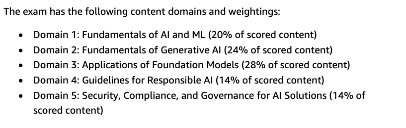
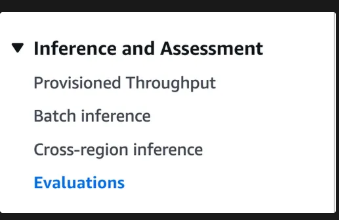

- Day 1
  collapsed:: true
	- Collected Notes and agreed on materials
- Day 2
  collapsed:: true
	- # AWS Certified AI Practitioner (AIF-C01) Plan
	  
	  [https://d1.awsstatic.com/training-and-certification/docs-ai-practitioner/AWS-Certified-AI-Practitioner_Exam-Guide.pdf?p=cert&c=ai&z=3](https://d1.awsstatic.com/training-and-certification/docs-ai-practitioner/AWS-Certified-AI-Practitioner_Exam-Guide.pdf?p=cert&c=ai&z=3)
	  
	  
	  
	  Timelines: 
	  
	  Complete course on 21st April
	  
	  12th May - Exam
	  
	  ---
	- ## Domain 1:  Fundamentals of AI and ML
	- Domain 1: Fundamentals of AI and ML 20%
	- ## Task Statement 1.1: Explain basic AI concepts and terminologies.
	    
	    Objectives:
	    • Define basic AI terms (for example, AI, ML, deep learning, neural networks,
	    computer vision, natural language processing [NLP], model, algorithm,
	    training and inferencing, bias, fairness, fit, large language model [LLM]).
	    • Describe the similarities and differences between AI, ML, and deep learning.
	    • Describe various types of inferencing (for example, batch, real-time).
	    • Describe the different types of data in AI models (for example, labeled and
	    unlabeled, tabular, time-series, image, text, structured and unstructured).
	    • Describe supervised learning, unsupervised learning, and reinforcement
	    learning.
	- ## Task Statement 1.2: Identify practical use cases for AI.
	    
	    Objectives:
	    • Recognize applications where AI/ML can provide value (for example, assist
	    human decision making, solution scalability, automation).
	    • Determine when AI/ML solutions are not appropriate (for example, cost-
	    benefit analyses, situations when a specific outcome is needed instead of a
	    prediction).
	    • Select the appropriate ML techniques for specific use cases (for example,
	    regression, classification, clustering).
	    • Identify examples of real-world AI applications (for example, computer
	    vision, NLP, speech recognition, recommendation systems, fraud detection,
	    forecasting).
	    • Explain the capabilities of AWS managed AI/ML services (for example,
	    SageMaker, Amazon Transcribe, Amazon Translate, Amazon Comprehend,
	    Amazon Lex, Amazon Polly).
	- ## Task Statement 1.3: Describe the ML development lifecycle.
	    Objectives:
	    • Describe components of an ML pipeline (for example, data collection,
	    exploratory data analysis [EDA], data pre-processing, feature engineering,
	    model training, hyperparameter tuning, evaluation, deployment,
	    monitoring).
	    • Understand sources of ML models (for example, open source pre-trained
	    models, training custom models).
	    • Describe methods to use a model in production (for example, managed API
	    service, self-hosted API).
	    • Identify relevant AWS services and features for each stage of an ML pipeline
	    (for example, SageMaker, Amazon SageMaker Data Wrangler, Amazon
	    SageMaker Feature Store, Amazon SageMaker Model Monitor).
	    • Understand fundamental concepts of ML operations (MLOps) (for example,
	    experimentation, repeatable processes, scalable systems, managing
	    technical debt, achieving production readiness, model monitoring, model
	    re-training).
	    • Understand model performance metrics (for example, accuracy, Area Under
	    the ROC Curve [AUC], F1 score) and business metrics (for example, cost per
	    user, development costs, customer feedback, return on investment [ROI]) to
	    evaluate ML models.
	    
	  
	  | Task | Mapped AWS Services | Status |
	  | --- | --- | --- |
	  | Explain basic AI concepts | General – no specific services |  |
	  | Identify practical AI use cases | Amazon SageMaker, Amazon Comprehend, Amazon Transcribe, Amazon Translate, Amazon Lex, Amazon Polly |  |
	  | Describe the ML development lifecycle | Amazon SageMaker, SageMaker Data Wrangler, SageMaker Feature Store, SageMaker Model Monitor, Amazon Augmented AI (A2I) |  |
	  | Understand MLOps concepts | Amazon SageMaker, SageMaker Model Monitor, Amazon CloudWatch |  |
	  | Evaluate model performance | Amazon SageMaker, CloudWatch, Amazon QuickSight (for custom metrics) |  |
	  |  |  |  |
	  |  |  |  |
	  
	  ---
	- ## Domain 2: Fundamentals of Generative AI
	- Domain 2 Fundamentals of Generative AI 24%
	- ## Task Statement 2.1: Explain the basic concepts of generative AI.
	    Objectives:
	    
	    • Understand foundational generative AI concepts (for example, tokens,
	    chunking, embeddings, vectors, prompt engineering, transformer-based
	    LLMs, foundation models, multi-modal models, diffusion models).
	    • Identify potential use cases for generative AI models (for example, image,
	    video, and audio generation; summarization; chatbots; translation; code
	    generation; customer service agents; search; recommendation engines).
	    • Describe the foundation model lifecycle (for example, data selection, model
	    selection, pre-training, fine-tuning, evaluation, deployment, feedback).
	- ## Task Statement 2.2: Understand the capabilities and limitations of generative AI for
	    solving business problems.
	    
	    Objectives:
	    • Describe the advantages of generative AI (for example, adaptability,
	    responsiveness, simplicity).
	    • Identify disadvantages of generative AI solutions (for example,
	    hallucinations, interpretability, inaccuracy, nondeterminism).
	    • Understand various factors to select appropriate generative AI models (for
	    example, model types, performance requirements, capabilities, constraints,
	    compliance).
	    • Determine business value and metrics for generative AI applications (for
	    example, cross-domain performance, efficiency, conversion rate, average
	    revenue per user, accuracy, customer lifetime value).
	- ## Task Statement 2.3: Describe AWS infrastructure and technologies for building
	    generative AI applications.
	    
	    Objectives:
	    • Identify AWS services and features to develop generative AI applications
	    (for example, Amazon SageMaker JumpStart; Amazon Bedrock; PartyRock,
	    an Amazon Bedrock Playground; Amazon Q).
	    • Describe the advantages of using AWS generative AI services to build
	    applications (for example, accessibility, lower barrier to entry, efficiency,
	    cost-effectiveness, speed to market, ability to meet business objectives).
	    • Understand the benefits of AWS infrastructure for generative AI
	    applications (for example, security, compliance, responsibility, safety).
	    • Understand cost tradeoffs of AWS generative AI services (for example,
	    responsiveness, availability, redundancy, performance, regional coverage,
	    token-based pricing, provision throughput, custom models)
	    
	  
	  | Task | Mapped AWS Services | Status |
	  | --- | --- | --- |
	  | Explain generative AI concepts | Amazon Bedrock, PartyRock, Amazon Q, SageMaker JumpStart |  |
	  | Capabilities and limitations of GenAI | Amazon Bedrock, Amazon SageMaker |  |
	  | AWS tech for GenAI apps | Amazon Bedrock, PartyRock, Amazon Q, SageMaker JumpStart, Amazon EC2, Amazon S3, IAM, CloudWatch, Amazon VPC |  |
	  
	  ---
	- ## Domain 3:  Applications of Foundation Models
	- Domain 3: Applications of Foundation Models 28%
	- ## Task Statement 3.1: Describe design considerations for applications that use
	    foundation models.
	    
	    Objectives:
	    • Identify selection criteria to choose pre-trained models (for example, cost,
	    modality, latency, multi-lingual, model size, model complexity,
	    customization, input/output length).
	    • Understand the effect of inference parameters on model responses (for
	    example, temperature, input/output length).
	    • Define Retrieval Augmented Generation (RAG) and describe its business
	    applications (for example, Amazon Bedrock, knowledge base).
	    • Identify AWS services that help store embeddings within vector databases
	    (for example, Amazon OpenSearch Service, Amazon Aurora, Amazon
	    Neptune, Amazon DocumentDB [with MongoDB compatibility], Amazon
	    RDS for PostgreSQL).
	    • Explain the cost tradeoffs of various approaches to foundation model
	    customization (for example, pre-training, fine-tuning, in-context learning,
	    RAG).
	    • Understand the role of agents in multi-step tasks (for example, Agents for
	    Amazon Bedrock).
	- ## Task Statement 3.2: Choose effective prompt engineering techniques.
	    Objectives:
	    
	    • Describe the concepts and constructs of prompt engineering (for example,
	    context, instruction, negative prompts, model latent space).
	    • Understand techniques for prompt engineering (for example, chain-of-
	    thought, zero-shot, single-shot, few-shot, prompt templates).
	    • Understand the benefits and best practices for prompt engineering (for
	    example, response quality improvement, experimentation, guardrails,
	    discovery, specificity and concision, using multiple comments).
	    • Define potential risks and limitations of prompt engineering (for example,
	    exposure, poisoning, hijacking, jailbreaking).
	    Task Statement 3.3: Describe the training and fine-tuning process for foundation
	    models.
	    Objectives:
	    • Describe the key elements of training a foundation model (for example,
	    pre-training, fine-tuning, continuous pre-training).
	    • Define methods for fine-tuning a foundation model (for example,
	    instruction tuning, adapting models for specific domains, transfer learning,
	    continuous pre-training).
	    • Describe how to prepare data to fine-tune a foundation model (for
	    example, data curation, governance, size, labeling, representativeness,
	    reinforcement learning from human feedback [RLHF]).
	- ## Task Statement 3.4: Describe methods to evaluate foundation model performance.
	    Objectives:
	    • Understand approaches to evaluate foundation model performance (for
	    example, human evaluation, benchmark datasets).
	    • Identify relevant metrics to assess foundation model performance (for
	    example, Recall-Oriented Understudy for Gisting Evaluation [ROUGE],
	    Bilingual Evaluation Understudy [BLEU], BERTScore).
	    • Determine whether a foundation model effectively meets business
	    objectives (for example, productivity, user engagement, task engineering).
	    
	  
	  | Task | Mapped AWS Services | Status |
	  | --- | --- | --- |
	  | Design considerations | Amazon Bedrock, Amazon OpenSearch Service, Amazon Neptune, Amazon Aurora, RDS for PostgreSQL, Amazon DocumentDB |  |
	  | Prompt engineering | Amazon Bedrock, PartyRock, Amazon Q |  |
	  | Training/fine-tuning foundation models | Amazon SageMaker, Amazon Bedrock |  |
	  | Evaluate foundation model performance | Amazon SageMaker, SageMaker Model Monitor, Amazon Augmented AI (A2I) |  |
	  
	  ---
	- ## Domain 4: Guidelines for Responsible AI
	- Domain 4: Guidelines for Responsible AI 14%
	- ## Task Statement 4.1: Explain the development of AI systems that are responsible.
	    Objectives:
	    
	    • Identify features of responsible AI (for example, bias, fairness, inclusivity,
	    robustness, safety, veracity).
	    • Understand how to use tools to identify features of responsible AI (for
	    example, Guardrails for Amazon Bedrock).
	    • Understand responsible practices to select a model (for example,
	    environmental considerations, sustainability).
	    • Identify legal risks of working with generative AI (for example, intellectual
	    property infringement claims, biased model outputs, loss of customer trust,
	    end user risk, hallucinations).
	    • Identify characteristics of datasets (for example, inclusivity, diversity,
	    curated data sources, balanced datasets).
	    • Understand effects of bias and variance (for example, effects on
	    demographic groups, inaccuracy, overfitting, underfitting).
	    • Describe tools to detect and monitor bias, trustworthiness, and truthfulness
	    (for example, analyzing label quality, human audits, subgroup analysis,
	    Amazon SageMaker Clarify, SageMaker Model Monitor, Amazon Augmented
	    AI [Amazon A2I]).
	- ## Task Statement 4.2: Recognize the importance of transparent and explainable
	    models.
	    Objectives:
	    
	    • Understand the differences between models that are transparent and
	    explainable and models that are not transparent and explainable.
	    • Understand the tools to identify transparent and explainable models (for
	    example, Amazon SageMaker Model Cards, open source models, data,
	    licensing).
	    • Identify tradeoffs between model safety and transparency (for example,
	    measure interpretability and performance).
	    • Understand principles of human-centered design for explainable AI
	    
	  
	  | Task | Mapped AWS Services | Status |
	  | --- | --- | --- |
	  | Develop responsible AI systems | SageMaker Clarify, SageMaker Model Monitor, Amazon Augmented AI (A2I), Guardrails for Amazon Bedrock |  |
	  | Transparent and explainable models | SageMaker Model Cards, SageMaker JumpStart (open-source models) |  |
	  
	  ---
	- ## Domain 5: Security, Compliance, and Governance for AI Solutions
	- Domain 5: Security, Compliance, and Governance for AI Solutions 14%
	    
	    Task Statement 5.1: Explain methods to secure AI systems.
	    Objectives:
	    
	    • Identify AWS services and features to secure AI systems (for example, IAM
	    roles, policies, and permissions; encryption; Amazon Macie; AWS
	    PrivateLink; AWS shared responsibility model).
	    • Understand the concept of source citation and documenting data origins
	    (for example, data lineage, data cataloging, SageMaker Model Cards).
	    • Describe best practices for secure data engineering (for example, assessing
	    data quality, implementing privacy-enhancing technologies, data access
	    control, data integrity).
	    • Understand security and privacy considerations for AI systems (for example,
	    application security, threat detection, vulnerability management,
	    infrastructure protection, prompt injection, encryption at rest and in
	    transit).
	    
	    Task Statement 5.2: Recognize governance and compliance regulations for AI
	    systems.
	    Objectives:
	    
	    • Identify regulatory compliance standards for AI systems (for example,
	    International Organization for Standardization [ISO], System and
	    Organization Controls [SOC], algorithm accountability laws).
	    • Identify AWS services and features to assist with governance and regulation
	    compliance (for example, AWS Config, Amazon Inspector, AWS Audit
	    Manager, AWS Artifact, AWS CloudTrail, AWS Trusted Advisor).
	    • Describe data governance strategies (for example, data lifecycles, logging,
	    residency, monitoring, observation, retention).
	    • Describe processes to follow governance protocols (for example, policies,
	    review cadence, review strategies, governance frameworks such as the
	    Generative AI Security Scoping Matrix, transparency standards, team
	    training requirements).
	    
	  
	  | Task | Mapped AWS Services | Status |
	  | --- | --- | --- |
	  | Secure AI systems | IAM, AWS Key Management Service (KMS), Amazon Macie, AWS PrivateLink, Amazon S3, SageMaker Model Cards |  |
	  | Compliance and governance | AWS Config, Amazon Inspector, AWS Audit Manager, AWS Artifact, AWS CloudTrail, AWS Trusted Advisor |  |
	  | Data governance strategies | AWS CloudTrail, Amazon Macie, AWS Audit Manager, Amazon S3, Amazon RDS, Amazon Redshift, AWS Glue, Lake Formation |  |
- Day 3
  collapsed:: true
	- ### Vocabulary set 1 summary
	  collapsed:: true
		- **Artificial Intelligence (AI):** AI simulates human
		  intelligence through computer systems, capable of performing tasks that
		  typically require human intelligence.
		- **Machine Learning (ML):** A subset of AI, ML enables
		  systems to learn from data and improve over time without human
		  intervention, using mathematical algorithms to identify patterns and
		  make predictions.
		- **Artificial Neural Networks (ANN):** A subset of ML,
		  ANNs mimic the human brain's network to recognize patterns and improve
		  accuracy through interconnected nodes and neurons.
		- **Deep Learning (DL):** Utilizes ANNs to analyze
		  patterns in data, commonly applied to sound, text, and images, using
		  multiple network layers to identify complex patterns.
		- **Generative AI (GAI):** A subset of DL, GAI models
		  create new content (e.g., images, text, audio) using large datasets,
		  producing outputs that resemble human-created content.
		- **Foundation Models (FM):** Trained on extensive
		  datasets, FMs serve as the basis for developing models that interpret
		  language, generate images, and more, with examples like Stable Diffusion for images and GPT-4 for language.
		- **Large Language Models (LLM):** Used in GAI to generate text by predicting and translating content, LLMs are trained on
		  transformer models and focus on language patterns and algorithms.
		- **Natural Language Processing (NLP):** Enables systems
		  to understand and interpret human language in written and verbal forms,
		  involving natural language understanding (NLU) and generation (NLG).
		- **Transformer Model:** A deep learning architecture that processes text and captures relationships between text elements,
		  supporting LLMs and enabling tasks like language translation and data
		  transformation.
		- **Generative Pretrained Transformer (GPT):** Utilizes
		  transformer models for generating human-like content, extensively used
		  in applications like text summarization and chatbots, exemplified by
		  ChatGPT.
		  
		  <!-- notionvc: 413d4277-dd01-4d13-8a5b-e0987a96141d -->
	- ### Vocabulary set 2 summary
	  collapsed:: true
		- **Responsible AI**: Emphasizes the importance of
		  ethical, lawful, and transparent AI practices to ensure trust and
		  confidence in AI systems. It involves setting principles and frameworks
		  to govern AI's impact on humanity.
		- **Labelled Data**: Refers to data tagged with
		  informative labels, aiding machine learning models in understanding and
		  learning from raw data. It requires human intervention for accurate
		  labeling.
		- **Supervised Learning**: A machine learning method using labeled datasets to predict outputs. The algorithm learns the
		  relationship between input and output data, with corrections made for
		  errors during training.
		- **Unsupervised Learning**: Involves learning from
		  unlabeled data, where the model autonomously identifies patterns and
		  relationships within the data without predefined labels.
		- **Semi-supervised Learning**: Combines supervised and
		  unsupervised learning, using a small set of labeled data alongside a
		  larger set of unlabeled data to improve model training efficiency.
		- **Prompt Engineering**: Involves refining input prompts
		  for large language models to optimize their output. It enhances AI
		  performance by adjusting prompts to produce more relevant responses.
		- **Prompt Chaining**: A technique for creating
		  conversational interactions with language models by using a series of
		  prompts, enhancing contextual awareness and user experience, often used
		  in chatbots.
		- **Retrieval Augmented Generation (RAG)**: A framework
		  that supplements AI models with external factual data to generate
		  accurate and up-to-date responses, enhancing the model's reliability.
		- **Parameters**: Variables within a machine learning
		  model that are adjusted during training to optimize performance and
		  improve the model's ability to generalize data patterns.
		- **Fine Tuning**: The process of adjusting a pre-trained
		  model on specific tasks or datasets to enhance its performance, allowing it to adapt to new data and improve accuracy for targeted applications.
		  
		  <!-- notionvc: c9c53eed-11d2-489e-8ed9-881d18d85ec7 -->
	- ### Vocabulary set 3 summary
	  collapsed:: true
		- **Bias**: In machine learning, bias refers to the
		  distortion in data that can lead to unfair and inaccurate model
		  outcomes. High-quality data is crucial to avoid biased results.
		- **Hallucinations**: AI hallucinations occur when AI
		  generates false responses that seem factual. They can result from biased data or misinterpretation during training.
		- **Temperature**: This parameter in AI models controls
		  the randomness of output. A lower temperature results in more focused
		  responses, while a higher temperature leads to more diverse outputs.
		- **Anthropomorphism**: This is the attribution of human
		  traits to non-human entities, including AI. As AI becomes more complex,
		  people may start to anthropomorphize it, affecting interactions.
		- **Completion**: In NLP, completion refers to the output generated by a model in response to a prompt, such as an answer from a chatbot.
		- **Tokens**: Tokens are the basic units of text input for AI models, which can be words or parts of words. They are essential for processing and generating responses.
		- **Emergence in AI**: Emergence occurs when large models
		  exhibit unexpected behaviors not seen in smaller models, potentially
		  leading to unanticipated and harmful outcomes.
		- **Embeddings**: These are numerical representations of
		  data in multi-dimensional space, capturing semantic relationships. They
		  enhance AI's ability to understand language and images efficiently.
		- **Text Classification**: This involves training models
		  to categorize text based on content, using NLP to understand patterns
		  and context for tasks like sentiment analysis and topic categorization.
		- **Context Window**: This refers to the amount of text an AI model can process at once, determined by the number of tokens. It
		  influences how prompts are engineered for effective responses.
		  
		  <!-- notionvc: 12bad55a-4c14-4c38-8f4f-f16cc8f6aee0 -->
- Day 4
  collapsed:: true
	- ### Ethics and Concern
		- **Data Privacy Concerns**:
			- Generative AI tools like ChatGPT can pose risks to company and user data, as seen in a breach in March 2023.
			- Companies should read privacy statements, align their privacy
			  policies with service providers, and implement additional security
			  checks.
			- Anonymizing user data before using third-party services is recommended to mitigate risks.
		- **Generative AI Bias**:
			- Generative AI can inherit biases from its training data, leading to stereotypes, such as gender biases in generated images.
			- To combat bias, expand datasets, test for existing biases, and be transparent about biases when they cannot be removed.
		- **IP and Copyright Issues**
			- Using Generative AI to create content can lead to IP violations if copyrighted material is involved.
			- In the U.S., works created with Generative AI are not eligible for copyright protection.
			- Companies should be cautious about using Generative AI tools to avoid potential legal issues related to IP and copyright.
			  
			  Tools explored:
			   [Huggingface Bias Explorer](https://huggingface.co/spaces/society-ethics/DiffusionBiasExplorer) 
			   DiffusionBee Tool
	-
	- @@html: {{video https://youtu.be/odgLX52Ulyg}}@@
- Day 5
  collapsed:: true
	- # Day 5
	- Model access
		- By default not all model are enabled to account ,we need to get them enabled under model access section in Bedrock
	- Bedrock Playground
		- Amazon Bedrock's Playgrounds allow users to experiment with different foundation models through a graphical interface, enabling them to
		  determine the most suitable model for their needs.
		- These playgrounds support text, chat, and image-based generative AI
		  applications, offering flexibility in design and development.
		- Users can manipulate prompts and inference parameters to influence
		  model responses, aiding in aligning outputs with specific use cases.
		- Parameters
			- Randomness and diversity parameters include Temperature and Top P, which affect the focus and diversity of model outputs.
			- Length parameters, such as Max completion length and Stop sequences,
			  control the length and stopping points of generated responses.
			- Repetition parameters, including Presence penalty, Count penalty,
			  Frequency penalty, and Penalize special tokens, manage the repetition of tokens in outputs.
			- Adjusting these parameters can significantly alter the completion results
		- Model metrics, such as latency and cost, are available in the Chat
		  playground to help users evaluate model performance and suitability for
		  their use cases.
		- Users can define specific metric criteria to assess if a model meets
		  their requirements, with visual indicators highlighting any
		  discrepancies.
	- Selecting right Models
	    
	    Methods
		- Evaluations can be conducted in three modes: Automatic, Human: Bring
		  your own work team, and Human: AWS Managed work team, with human modes
		  incorporating human judgment.
		- Automatic evaluations involve an 8-step process: selecting a
		  foundation model, task type, metrics, dataset, specifying S3 storage
		  location, selecting IAM role, inference and scoring, and viewing
		  results.
		- Task types for automatic evaluations include general text generation, text summarization, question and answer, and text classification, with
		  metrics like toxicity, accuracy, and robustness.
		- Human evaluations allow for up to two models to be reviewed, with an
		  additional 'Custom' task type for tailored evaluations, and involve
		  setting up a work team, defining metrics, and providing instructions.
		- Human: Bring your own work team evaluations involve selecting models, task types, metrics, dataset location, S3 storage, setting permissions, setting up a work team, providing instructions, submitting the job,
		  completing workforce tasks, and viewing results.
		- Human: AWS Managed work team evaluations require naming the
		  evaluation, scheduling a consultation with AWS, liaising to finalize
		  requirements, and creating the job, with AWS managing the workforce and
		  criteria.
	- Setting up AWS Bedrock API
		- 3 ways:
		    
		    SDK
		    
		    CLI
		    
		    Sagemaker Notebook
		- permissions to access API
			- The AWS SDK supports multiple programming languages, including C++, Go,
			  Java, JavaScript, .NET, Python (Boto3), and Ruby. Each language has its
			  own way of interacting with the Bedrock APIs.
			- To use the AWS CLI, users must download, install, and configure it with the necessary permissions to access Amazon Bedrock.
			- When using an Amazon SageMaker notebook, the role associated with
			  the notebook must have specific permissions to access Amazon Bedrock.
			  This includes an inline policy allowing all Bedrock actions and a trust
			  relationship policy allowing Bedrock and SageMaker services to assume
			  the role.
			- The trust relationship policy is resource-based, defining which
			  entities can assume the role, granting full access to Amazon Bedrock as
			  specified in the inline policy.
			- With a SageMaker notebook, users can utilize the Python (Boto3) SDK to perform and invoke API operations.
	- Evaluate Model performance. - Lab
	    
	    [https://aws.amazon.com/blogs/aws/amazon-bedrock-model-evaluation-is-now-generally-available/](https://aws.amazon.com/blogs/aws/amazon-bedrock-model-evaluation-is-now-generally-available/)
	    
	    Doc page: [https://docs.aws.amazon.com/bedrock/latest/userguide/model-evaluation-jobs-management-create.html](https://docs.aws.amazon.com/bedrock/latest/userguide/model-evaluation-jobs-management-create.html)
		- Step References:
			- Sample Dataset:
			    
			    ```jsx
			    {"prompt":"The chemical symbol for gold is", "category":"Chemistry", "referenceResponse":"Au"}
			    {"prompt":"The tallest mountain in the world is", "category":"Geography", "referenceResponse":"Mount Everest"}
			    {"prompt":"The author of 'Great Expectations' is", "category":"Literature", "referenceResponse":"Charles Dickens"}
			    ```
			- Bucket CORS setting for dataset source
			    
			  
			  ```[
			    {
			    "AllowedHeaders": [
			    "*"
			    ],
			    "AllowedMethods": [
			    "GET",
			    "PUT",
			    "POST",
			    "DELETE"
			    ],
			    "AllowedOrigins": [
			    "*"
			    ],
			    "ExposeHeaders": [
			    "Access-Control-Allow-Origin"
			    ]
			    }
			    ]
			  ```
			- Evaluation steps
			    
			    In Bedrock
			    
			  
- Day 6
	- ### Prompt Engineering
	- Prompt Engineering Intro
		- Prompts are inputs given to generative AI systems to guide their output, with text-based prompts being the most common.
		- Prompt engineering involves crafting prompts that consistently yield the desired output, combining creativity and an iterative refinement
		  process.
		- The importance of prompt engineering lies in its ability to
		  transform interactions with AI, enabling natural language interfaces
		  over traditional user interfaces.
		- Generative AI is integrated into various products, such as Adobe's
		  Photoshop and Illustrator, GitHub's Copilot, and Salesforce's Einstein,
		  enhancing their capabilities through prompts.
		- Effective prompt engineering is crucial for maximizing the value extracted from generative AI systems.
		- The field is emerging, requiring experimentation, creativity, and patience, with significant rewards for those who master it.
	- collapsed:: true
	  
	  Prompt Anatomy
		- Objective:
		  
		  Goal of the prompt. eg: Summarize the document
		- **Context**: Additional information provided to help generate the desired response, though not always required.
		- **Markers**: Used to indicate specific sections of the prompt, aiding the model in understanding its structure.
	- Prompt creation process
	  collapsed:: true
		- Two main factors:
			- Objective. - Clearly define it
			- Verification process - same as verifying the code is that achieves the objective
		- Choose the right model for your use case
		- Prompt experiments
			- Experiment with prompt by varying parameters like temperature to understand the response
		- Prompt Analysis
			- Try to generate same results with different prompts and see how the prompt influences the response
		- Refinement
			- Refine your prompt further by cuttingout unwanted words in the prompt
		- Model Experiments
			- Now experiment the same with different Models and see how consistency you get same results for same prompt
		- Document
			- Document the result and prompt on various models for future reference
	- Standard Prompt Strategies
		- collapsed:: true
		  
		  Instruction Prompts
			- eg: Translate text to language Tamil
			  
			  > Instructions can be limited in response
		- collapsed:: true
		  
		  Question based Prompts
			- You can get more options and conversational
			- Question-based prompts can be categorized into open, closed, and leading questions,
			  each serving different purposes and influencing the scope and direction
			  of the response.
			- Open questions allow for expansive answers, closed questions
			  anticipate specific answers, and leading questions guide the model
			  towards a particular response.
		- Instructional prompts are explicit and useful for tasks requiring specific formatting, while question-based prompts allow for exploration and conversational interaction.
	- Contextual Prompts
		- Contextual prompts are divided into two sub-categories: role-playing and scenario-based prompts.
		- Role-playing prompts engage the model in a specific role, such as a
		  historical figure or professional, to generate content from different
		  perspectives and simulate creative thinking.
		- Scenario-based prompts set a specific situation, time, or place for
		  the model to consider, allowing exploration of specific events or
		  environments.
		- Both types of prompts require a deep understanding of the topic to create believable and effective contexts.
		- The complexity of the role or scenario should be carefully considered to avoid oversimplification or bias.
		- Role-playing and scenario-based prompts can be used together for more effective results.
		- The process of creating these prompts involves defining objectives,
		  including rules for context, and iteratively crafting the prompt to
		  achieve the desired response.
	- Few Shot Prompts
	  
	  Few-shot learning provides context to models, enabling them to understand and perform tasks more effectively by recognizing patterns from given examples.
	  
	  zero-shot, one-shot, and few-shot prompts:
		- Zero-shot prompts do not include examples and rely on the model's existing knowledge.
		- One-shot prompts include a single example to guide the model.
		- Few-shot prompts include multiple examples to provide a clearer understanding of the task.
	- Chain of Thought Prompts
		- Language models have limitations in performing complex reasoning tasks, such as
		  arithmetic or common-sense reasoning, and chain-of-thought prompts aim
		  to mitigate these limitations.
		- An example problem involving counting apples is used to demonstrate
		  the model's reasoning process. Initially, the model makes a mistake by
		  misinterpreting the phrase "shared an apple" as two apples instead of
		  one.
		- In above case break the problem statement and do one action at a time
		- while models are advancing, they can still provide incorrect answers confidently, so users should verify responses and use prompts to achieve desired outcomes.
	- Evaluating Response Accuracy
		- Generative AI models can provide inaccurate information confidently, highlighting the need for verification of responses.
		- A real-world example is provided where a lawyer used ChatGPT to
		  create a legal brief with fabricated cases, emphasizing the importance
		  of verifying AI-generated information.
		- To ensure accuracy, responses should be cross-referenced with
		  multiple reliable sources, and discrepancies should be investigated.
		- Prompts can impact response accuracy; leading, ambiguous, and biased prompts can lead to inaccuracies.
		- Leading prompts guide responses towards specific outcomes, which can result in fabricated responses.
		- Ambiguous prompts can be interpreted in multiple ways, leading to
		  inaccurate responses, while specific prompts help guide models towards
		  accurate answers.
		- Biased prompts and models can produce inaccurate responses by reflecting biases present in training data.
		- A prompt review process involving diverse perspectives is recommended to identify and avoid biases.
	- Response Formatting
	  
	  Types of response
		- Unstructured data is raw model output, ideal for plaintext consumption or intermediate steps like text-to-speech.
		- Loosely structured data, such as Markdown, enhances readability with minimal syntax for formatting text.
		- Highly structured data formats like JSON, YAML, XML, and CSV are
		  used for software consumption, requiring strict adherence to rules.
		  
		  >  Producing highly structured formats can be challenging due to non-deterministic model behavior, complexity, token consumption, and cost.
		- Lower temperature settings are recommended for predictable formatting, while higher temperatures are for creative responses.
		- Custom formats can be beneficial for specific use cases, simplifying the process and reducing effort compared to standard formats.
		- Consider using `retry` mechanism
	- Response Qualities
		- Language models can produce grammatically correct responses due to their
		  training on diverse data, which can be used for proofreading and editing human-written content.
		- Style and tone are context-dependent, with formal styles suited for
		  legal briefs and casual styles for blog posts. Prompts can adjust these
		  qualities by specifying terms like formal, casual, or friendly.
		- Emotion and sentiment in responses are more subjective and complex
		  to control. Prompts should include desired emotions or sentiments,
		  considering the emotional weight of words and punctuation.
		- Emotion and sentiment analysis requires understanding the model's
		  capabilities and may need pre-processing to avoid skewed results,
		  especially in longer content.
		- It's important to verify the desired qualities with human review,
		  especially for significant use cases, to ensure accuracy and
		  appropriateness.
		  
		  <!-- notionvc: 789c9882-2ab6-4994-a5e1-80b9173db6b9 -->