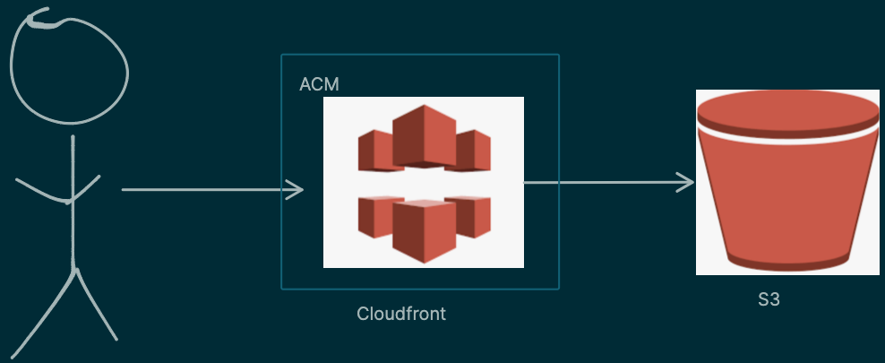

### Overview
      The site "docs.evidhai.com" is hosted on AWS and leverages several AWS services to ensure a robust, scalable, and secure architecture. The key services used in this architecture include Amazon S3 for file storage, AWS Certificate Manager (ACM) for SSL/TLS certificates, Amazon CloudFront for content delivery, and GitHub for code repository and continuous deployment.
-
- 
-
- ### Services Used
	- #### Amazon S3
	  
	  Amazon S3 (Simple Storage Service) is used to store the static files for the site. S3 provides a highly durable and available storage solution, making it ideal for hosting static websites. The files are stored in an S3 bucket, which serves as the origin for the CloudFront distribution.
	- #### AWS Certificate Manager (ACM)
	  
	  AWS Certificate Manager (ACM) is used to manage SSL/TLS certificates for the site. ACM simplifies the process of provisioning, managing, and deploying certificates, ensuring that the site is secure and that data is encrypted in transit.
	- #### Amazon CloudFront
	  
	  Amazon CloudFront is a Content Delivery Network (CDN) service that is used to deliver the content of the site to users with low latency and high transfer speeds. CloudFront caches the content at edge locations around the world, reducing the load on the S3 bucket and improving the performance of the site.
	- #### GitHub
	  
	  GitHub is used as the code repository for the site. The repository contains all the source code and configuration files needed to build and deploy the site. GitHub Actions is used to automate the deployment process.
- ### Deployment Process
  
  The entire deployment process is automated using GitHub Actions. When code is published to the repository, it triggers a GitHub Actions workflow that performs the following steps:
  
  1. **Checkout Code**: The workflow checks out the latest code from the repository.
  2. **Build Site**: The site is built using the specified build tools and configurations.
  3. **Sync Files to S3**: The built files are synced to the S3 bucket using the AWS CLI. This ensures that the latest version of the site is available in the S3 bucket.
  4. **Invalidate CloudFront Cache**: The CloudFront cache is invalidated to ensure that users receive the latest version of the site. This step is crucial because CloudFront caches content at edge locations, and invalidating the cache ensures that any changes to the site are immediately reflected to users.
- ### Conclusion
  The architecture of "docs.evidhai.com" leverages the power of AWS services to provide a scalable, secure, and high-performance solution for hosting static content. By using S3 for storage, ACM for certificates, CloudFront for content delivery, and GitHub for code management and deployment automation, the site ensures a seamless and efficient deployment process.