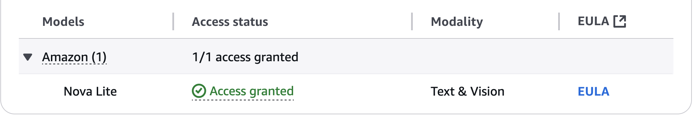
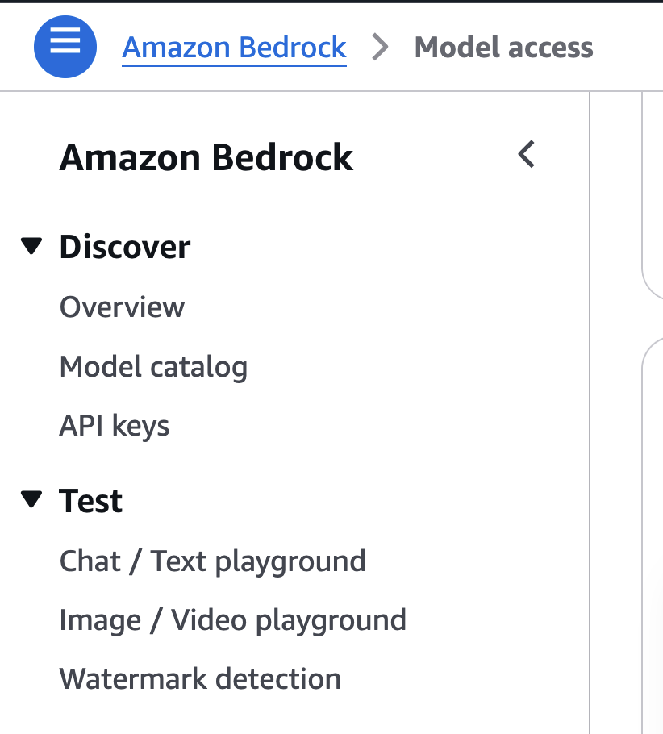
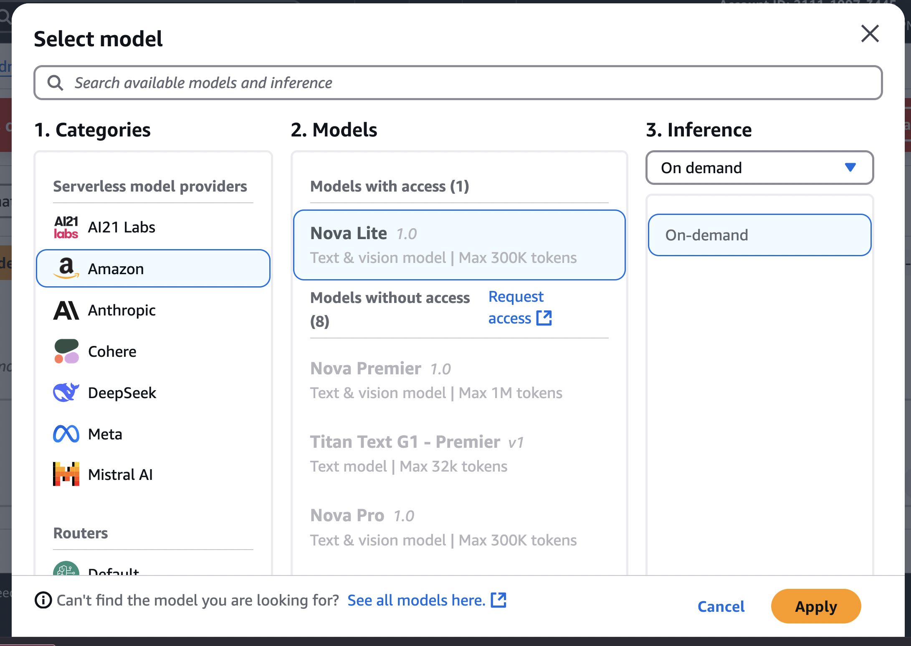
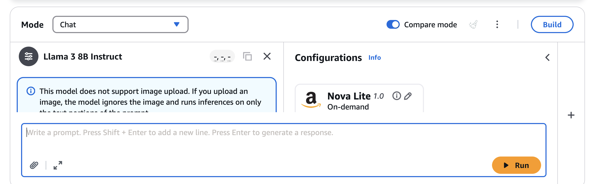

- #agentic_ai
- Today is about exploring Bedrock service on console,
	- Getting to know gaining model access
	- Testing models
	- Comparing models
	- Playing with image generations
	-
-
- Get yourself model access granted
	- 
- Bedrock offers your playgrounds to test your model
	- 
- On Text Lab choose the model that you want to test
	- 
- Not sure what model to choose ? They offer Compare functionality
	- 
	-